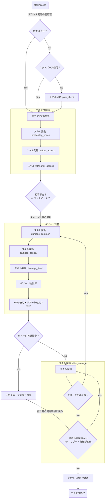

```mermaid
flowchart TD
    A(startAccess) -->|アクセス開始の前処理| B{"相手は不在？"}
    B -->|No| C{"フットバース使用？"}
    B -->|Yes| E
    C -->|No| D[スキル発動: pink_check]
    C -->|Yes| E
    D --> E
    subgraph アクセス開始
        E[スコア,EXの加算] --> F
        F[スキル発動: probability_check] --> G
        G[スキル発動: before_access] --> H
        H[スキル発動: after_access]
    end
    H --> I{"相手不在？\nor フットバース？"}
    I -->|ダメージ計算の開始| J
    subgraph ダメージ計算
        J[スキル発動: damage_common] --> K
        K[スキル発動: damage_special] --> L
        L[スキル発動: damage_fixed] --> M
        M[ダメージを計算] --> N
        N["HPの決定・リブート有無の判定"]
    end
    N --> R{"ダメージ再計算中？"}
    R -->|No| O
    R -->|Yes| S["元のダメージ計算と合算"]
    S -->|再計算の開始時点に戻る| Q
    subgraph スキル発動: after_damage
        O[スキル発動] --> P
        P{"ダメージを再計算？"} --> |No| Q
        Q{"スキル未発動 and\nHP・リブート有無が変化"} --> |Yes| O
    end
    P --> |Yes| J
    Q --> |No| T["アクセス結果の確定"]
    T --> U(アクセス終了)
```